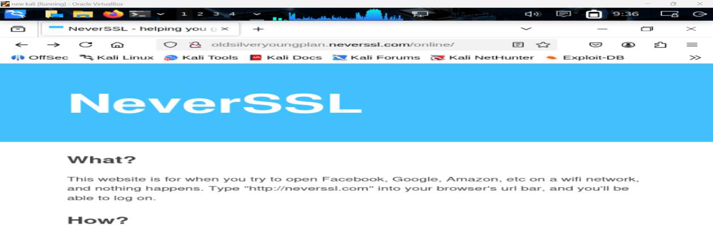
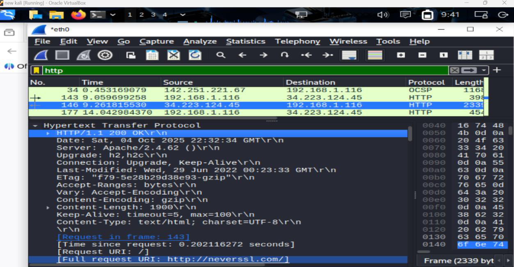
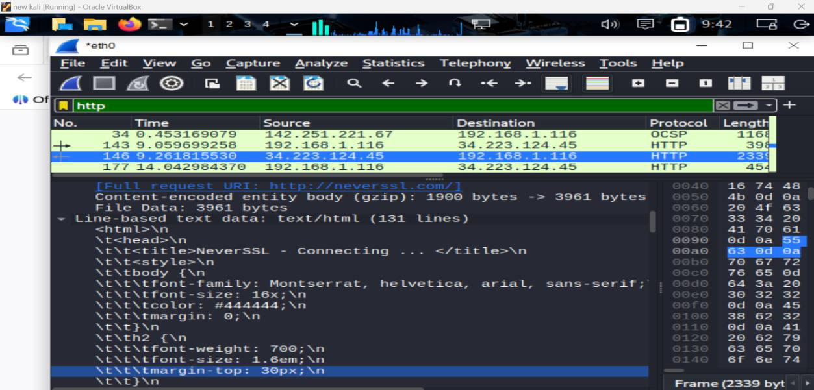
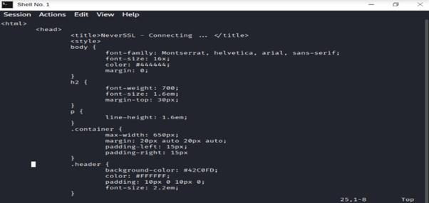
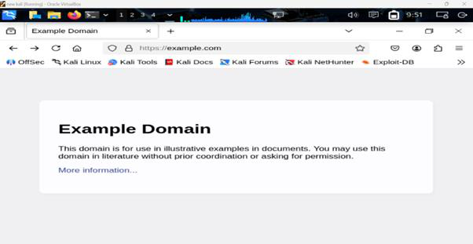
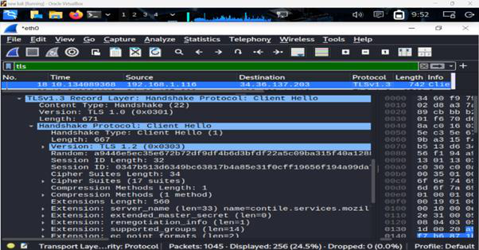
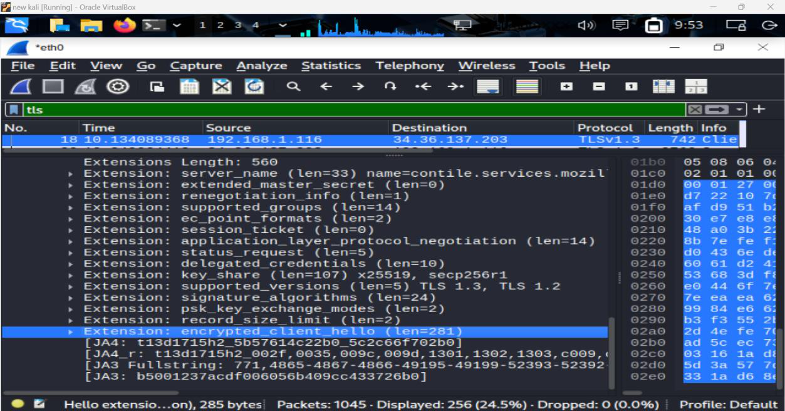

# Lab 3: HTTP vs HTTPS Traffic Analysis with Wireshark

> **Network Security Lab | Kali Linux | Wireshark**  
> Performed in a controlled environment for educational purposes only.

## Overview

This lab uses **Wireshark** to compare unencrypted HTTP traffic against TLS-encrypted HTTPS traffic. The goal is to demonstrate how sensitive data such as URLs, credentials, and form submissions are exposed in plaintext over HTTP, while remaining completely hidden under HTTPS.

---

## Tools Used

| Tool | Purpose |
|------|---------|
| Kali Linux | Lab environment |
| Wireshark | Network packet analyser |
| neverssl.com | HTTP-only test site (no encryption) |
| example.com | HTTPS test site (TLS encrypted) |

---

## Lab Walkthrough

---

## Part 1 — HTTP Traffic (Unencrypted)

### Step 1 – Open Wireshark and Apply HTTP Filter

Wireshark was launched on Kali Linux. The active network interface (`eth0`) was selected to begin packet capture. After visiting `neverssl.com`, the display filter `http` was applied to isolate HTTP packets only.



---

### Step 2 – HTTP Plaintext Exposed

Inspecting the captured HTTP GET packet revealed all request data in **plaintext** — fully readable with no decryption needed. The following sensitive fields were visible:

- **Request URI** — the full URL being accessed
- **Host Header** — the domain name of the site
- **User-Agent Header** — the browser and OS details of the client



---

### Step 3 – Full HTTP Request Visible

Expanding the Hypertext Transfer Protocol section in the Packet Details pane confirmed the complete HTTP request was readable — including the full request URI `http://neverssl.com/`. Any passive attacker on the same network could intercept and read this data with zero effort.



---

### Step 4 – NeverSSL Website Visited

`neverssl.com` was used as the HTTP traffic source — a site specifically designed to never use SSL/TLS, making it ideal for demonstrating plaintext HTTP vulnerability.



---

## Part 2 — HTTPS Traffic (TLS Encrypted)

### Step 5 – Visit HTTPS Site (example.com)

A new Wireshark capture was started. `example.com` was visited, which triggers a TLS handshake and establishes an encrypted session before any data is transferred.



---

### Step 6 – Apply TLS Filter

The Wireshark capture was stopped and the display filter `tls` was applied to isolate Transport Layer Security packets. The TLS handshake packets (Client Hello, Server Hello, etc.) were visible — but no actual content.



---

### Step 7 – HTTPS Data Confirmed Encrypted

Selecting an `Application Data` packet and expanding the Transport Layer Security section showed the payload explicitly marked as **Encrypted Application Data**. Wireshark can see the packets being exchanged but cannot read the content without the cryptographic key — confirming HTTPS protection is working.



---

## Key Findings

| | HTTP | HTTPS |
|---|---|---|
| **Data Visibility** | Fully readable in plaintext | Encrypted — unreadable without key |
| **URL Exposed** | ✅ Yes | ❌ No |
| **Credentials Exposed** | ✅ Yes | ❌ No |
| **Vulnerable to Sniffing** | ✅ Yes | ❌ No |
| **Protocol** | HTTP/1.1 | TLS 1.2 / TLS 1.3 |

**Bottom line:** Any attacker on the same network (coffee shop Wi-Fi, shared LAN) can intercept all HTTP traffic in real time. HTTPS makes that interception useless — the data is encrypted end-to-end.

---

## Prevention Methods

| Type | Prevention Method | Description / Purpose |
|---|---|---|
| **Technical** | **Use HTTPS Only** | Ensure all websites use HTTPS to encrypt data in transit. Redirect HTTP to HTTPS. |
| **Technical** | **Enable HSTS** | Forces browsers to always use HTTPS, preventing downgrade to HTTP. |
| **Technical** | **Strong TLS Configuration** | Disable outdated protocols (TLS 1.0/1.1) and weak ciphers. |
| **Technical** | **VPN on Public Wi-Fi** | Encrypts all traffic, protecting it from local network sniffing. |
| **Technical** | **Secure Network Infrastructure** | Use switches (not hubs), enable port security, apply ARP/DHCP protections. |
| **User Practice** | **Verify HTTPS and Padlock Icon** | Check for secure HTTPS connections before entering credentials. |
| **User Practice** | **Avoid Submitting Data Over HTTP** | Never enter login details or sensitive info on unencrypted websites. |
| **User Practice** | **Use Password Managers** | They autofill only on legitimate, secure domains — won't fill on suspicious pages. |
| **User Practice** | **Regular User Education** | Train users to identify secure sites and avoid unsafe online behaviour. |

---

## Useful Wireshark Filters Reference

```
# Filter HTTP traffic only
http

# Filter HTTPS/TLS traffic only
tls

# Filter by specific host
http.host == "neverssl.com"

# Filter HTTP GET requests only
http.request.method == "GET"

# Filter HTTP POST requests (form submissions)
http.request.method == "POST"

# Show only TLS handshake packets
tls.handshake

# Filter by IP address
ip.addr == 192.168.1.1
```

---

## Disclaimer

> This lab was conducted in a **controlled, isolated environment** for educational purposes as part of MIT503 Information Security coursework at NAPS. All traffic captured was generated by the lab participant on their own machine. No third-party traffic was intercepted or stored.
